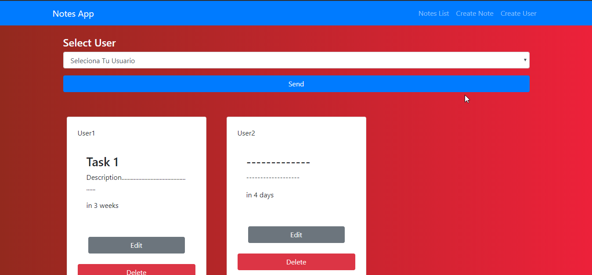
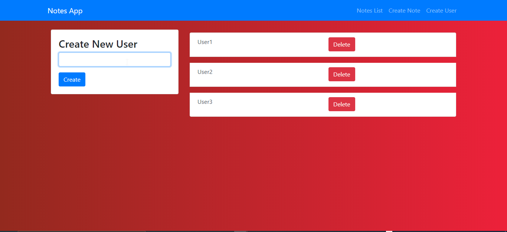

# Task App

This is a task application developed under the CRUD concept, where you can schedule all the tasks you have in life.

The application uses StackMERN which means that we are using React to do the whole interface with js and then we connect with the api through mongoDB and an ORM as mongoose with the help of Node and its Framework Expess.

- Javascript

- React

- Bootstrap

- MongoDb

- Mongoose

- Webpack

- Node

- Express

## Steps
- You must install all the packages and dependencies that are specified in the package.json

- Then, Start the Backend with the script (npm run build at CLI) and the Frontend with (npm start at CLI), then the applications will run on a local server so you can enjoy both sides of the application.

- Ready, after all the above named the application tells you how to group your tasks by users and how to schedule them by date so that you are organized.

